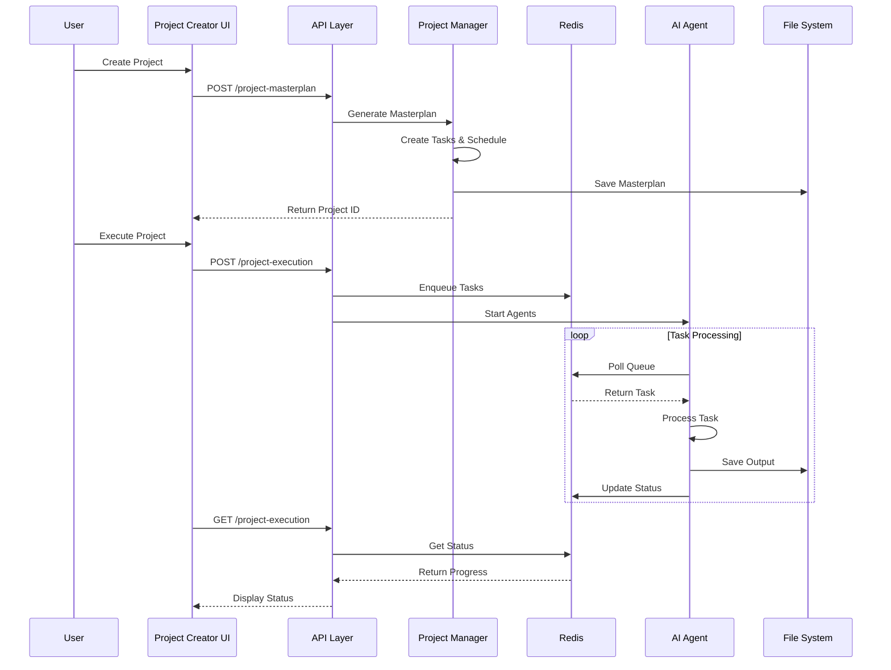

# Ez Aigent Project Creator Architecture

## System Overview

```mermaid
graph TB
    subgraph "User Interface"
        UI[Project Creator UI]
        Dashboard[Dashboard]
    end
    
    subgraph "API Layer"
        API1[/api/project-masterplan]
        API2[/api/project-execution]
        API3[/api/agent-control]
    end
    
    subgraph "Core Services"
        PM[Project Manager]
        AO[Agent Orchestrator]
        TS[Task Scheduler]
    end
    
    subgraph "Message Queue"
        Redis[(Redis)]
        Q1[claude queue]
        Q2[gpt queue]
        Q3[deepseek queue]
        Q4[mistral queue]
        Q5[gemini queue]
    end
    
    subgraph "AI Agents"
        Claude[Claude Agent<br/>Architecture & Refactoring]
        GPT[GPT Agent<br/>Backend & APIs]
        DeepSeek[DeepSeek Agent<br/>Testing & Validation]
        Mistral[Mistral Agent<br/>Frontend & Docs]
        Gemini[Gemini Agent<br/>Security & DevOps]
    end
    
    subgraph "Storage"
        FS[File System<br/>projects/]
        Memory[Agent Memory<br/>.agent-memory/]
    end
    
    UI --> API1
    UI --> API2
    UI --> API3
    
    API1 --> PM
    API2 --> AO
    API3 --> AO
    
    PM --> TS
    TS --> Redis
    AO --> Redis
    
    Redis --> Q1 --> Claude
    Redis --> Q2 --> GPT
    Redis --> Q3 --> DeepSeek
    Redis --> Q4 --> Mistral
    Redis --> Q5 --> Gemini
    
    Claude --> FS
    GPT --> FS
    DeepSeek --> FS
    Mistral --> FS
    Gemini --> FS
    
    Claude --> Memory
    GPT --> Memory
    DeepSeek --> Memory
    Mistral --> Memory
    Gemini --> Memory
    
    Dashboard --> UI
```

## Data Flow



## Component Responsibilities

### 1. **Project Creator UI**
- User input collection
- Project configuration
- Real-time status display
- Execution controls

### 2. **API Layer**
- Request validation
- Business logic orchestration
- Response formatting
- Error handling

### 3. **Project Manager**
- Masterplan generation
- Task breakdown
- Agent assignment
- Schedule optimization

### 4. **Agent Orchestrator**
- Agent lifecycle management
- Resource allocation
- Failure recovery
- Load balancing

### 5. **Task Scheduler**
- Task prioritization
- Dependency management
- Parallel execution
- Queue management

### 6. **AI Agents**
Each agent specializes in specific tasks:
- **Claude**: System architecture, complex refactoring
- **GPT-4o**: Backend development, API integration
- **DeepSeek**: Testing, validation, debugging
- **Mistral**: Frontend, documentation, UI/UX
- **Gemini**: Security, DevOps, monitoring

### 7. **Redis Queue**
- Task distribution
- Status tracking
- Agent communication
- Failure handling

### 8. **Storage Layer**
- Project files
- Agent memory
- Task outputs
- Execution logs

## Key Design Patterns

### 1. **Queue-Based Architecture**
- Decoupled components
- Scalable processing
- Fault tolerance
- Load distribution

### 2. **Agent Specialization**
- Task-specific expertise
- Optimized token usage
- Parallel processing
- Quality assurance

### 3. **Event-Driven Updates**
- Real-time progress
- Status notifications
- Error propagation
- State synchronization

### 4. **Persistent Storage**
- Project continuity
- Memory retention
- Output preservation
- Audit trails

## Scaling Considerations

### Horizontal Scaling
- Multiple agent instances per type
- Redis cluster support
- Load balancer integration
- Distributed file storage

### Vertical Scaling
- Agent resource allocation
- Queue depth management
- Batch processing
- Memory optimization

## Security Measures

### API Security
- Authentication endpoints
- Request validation
- Rate limiting
- CORS configuration

### Data Protection
- API key encryption
- Secure file storage
- Access control
- Audit logging

### Agent Isolation
- Sandboxed execution
- Resource limits
- Output validation
- Error boundaries